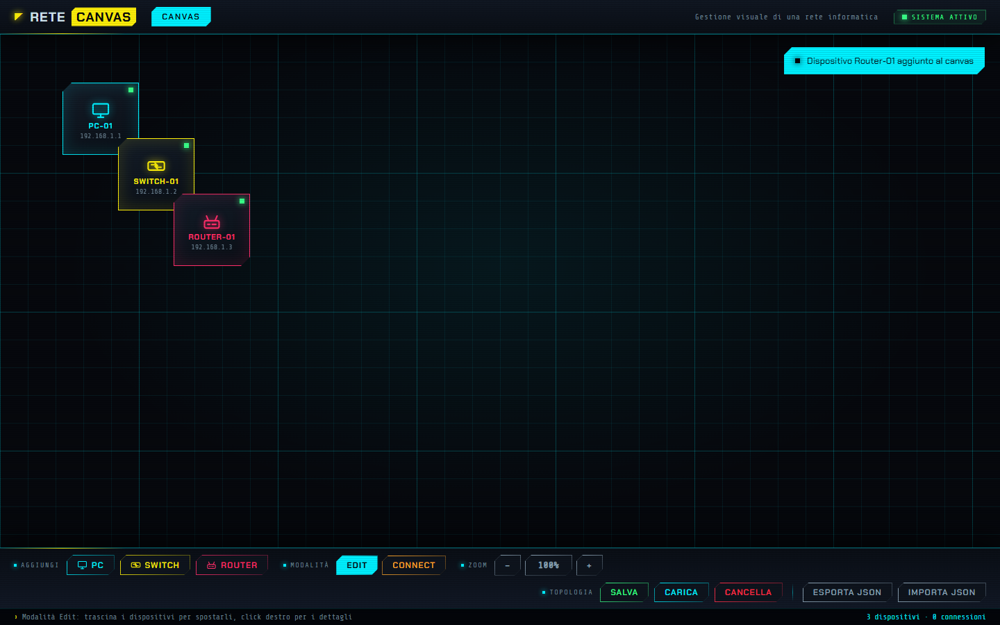
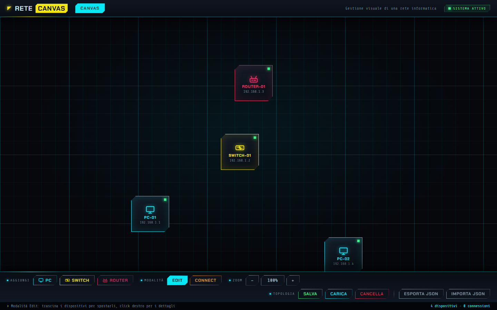
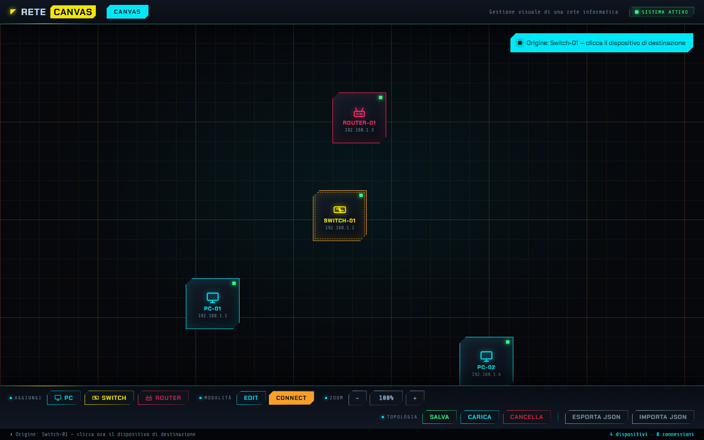
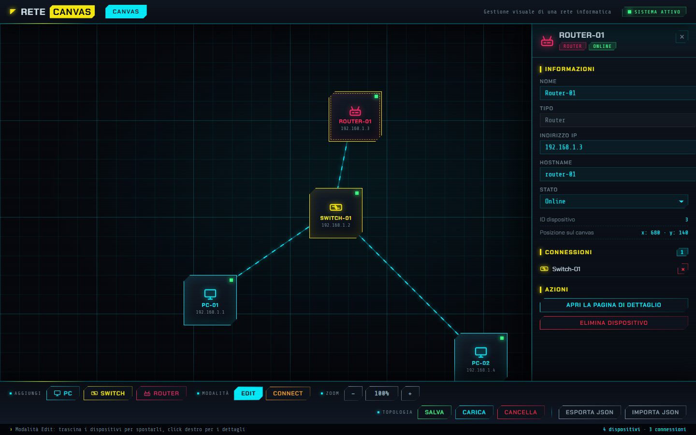
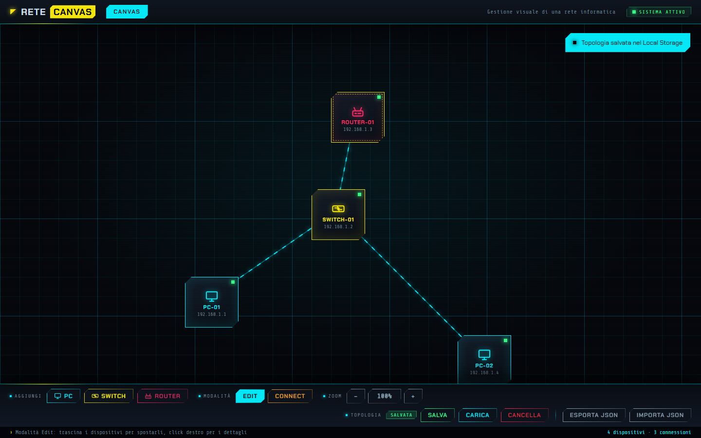
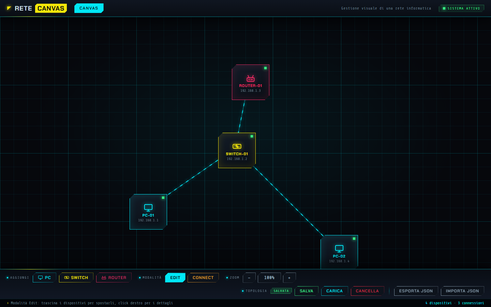
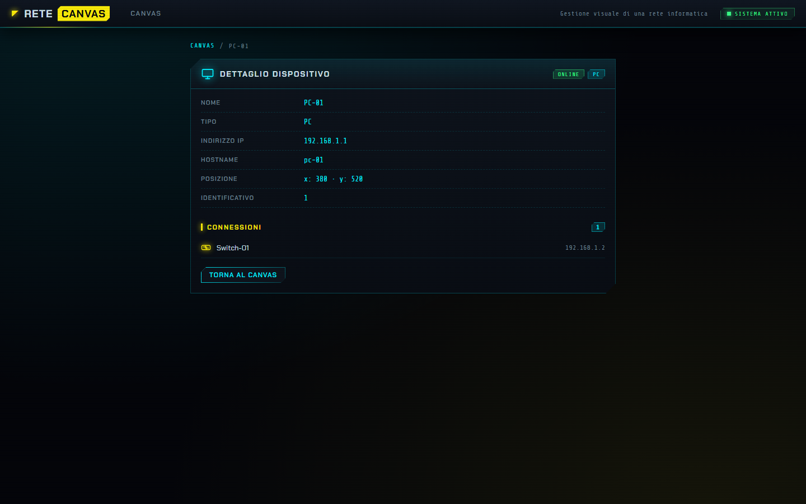
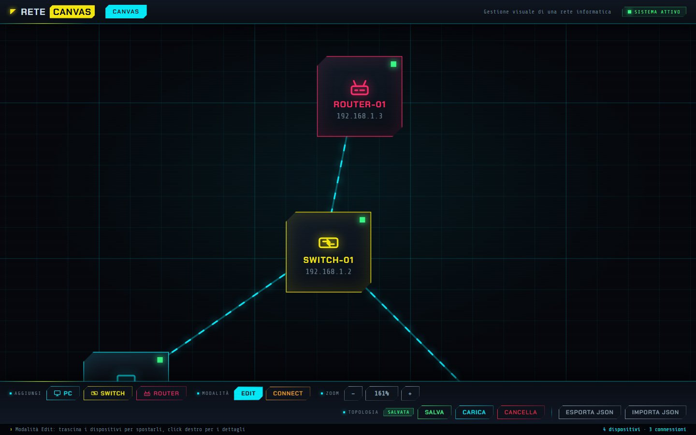

# ReteCanvas — Gestione visuale di una rete informatica

Applicazione Angular che mette a disposizione un **canvas** sul quale costruire una topologia di
rete: si aggiungono **PC**, **Switch** e **Router**, si posizionano liberamente con il trascinamento
e li si collega tra loro. La topologia viene salvata nel **Local Storage** del browser e ripristinata
automaticamente alla riapertura dell'applicazione.

---

## Indice

1. [Descrizione del progetto](#1-descrizione-del-progetto)
2. [Tecnologie utilizzate](#2-tecnologie-utilizzate)
3. [Architettura del progetto](#3-architettura-del-progetto)
4. [Modello dati](#4-modello-dati)
5. [Istruzioni di avvio](#5-istruzioni-di-avvio)
6. [Screenshot di funzionamento](#6-screenshot-di-funzionamento)

---

## 1. Descrizione del progetto

L'obiettivo è realizzare uno strumento visuale per comporre e modificare una semplice rete
informatica, seguendo il flusso tipico di un editor grafico: si sceglie un elemento dalla barra
degli strumenti, lo si posiziona sul canvas e lo si collega agli altri.

### Requisiti richiesti

| Requisito | Come è stato realizzato |
| --- | --- |
| Canvas per la topologia | Area di lavoro da 4000 × 3000 px con griglia di sfondo |
| Dispositivi PC, Switch e Router | Tre pulsanti nella barra degli strumenti, un'icona SVG dedicata per ogni tipo |
| Icona grafica per ogni dispositivo | Componente `IconaDispositivo`, con tre disegni SVG distinti |
| Dati del dispositivo: id, tipo, nome, x, y | Classe `Dispositivo`, con id progressivo e nome automatico (`PC-01`, `Switch-01`, …) |
| Posizionamento libero con drag & drop | Trascinamento con i Pointer Events; le coordinate `x` e `y` vengono aggiornate a ogni movimento |
| Connessioni con click sorgente → click destinazione | Modalità **Connect**: il primo click sceglie l'origine, il secondo crea il collegamento |
| Connessione: id, sourceId, targetId | Classe `Connessione` |
| Linee aggiornate automaticamente | Le linee sono un `computed()` calcolato sulle posizioni dei dispositivi: seguono i dispositivi mentre vengono spostati |
| Dettaglio del dispositivo con il click destro | Pannello laterale con modifica dei dati e azioni sul dispositivo |
| Persistenza — **soluzione A: Local Storage** | Salvataggio, caricamento e cancellazione della topologia, con ripristino automatico all'avvio |

### Funzionalità aggiuntive opzionali

- **Eliminazione** di un dispositivo (con rimozione a cascata delle connessioni collegate) e di una
  singola connessione.
- **Rinomina** del dispositivo e modifica di **indirizzo IP**, **hostname** e **stato**
  (`Online`, `Offline`, `Manutenzione`).
- **Colori distinti per tipo**: blu per i PC, verde per gli Switch, rosso per i Router.
- **Evidenziazione della selezione** con bordo colorato e ombra.
- **Zoom** (da 0.3× a 2.5×, con la rotellina del mouse o con i pulsanti) e **panning** del canvas
  (trascinando lo sfondo), con pulsante per reimpostare la vista.
- **Esportazione e importazione** della topologia in formato **JSON**.
- **Nessun collegamento di un dispositivo a sé stesso** e **nessuna connessione duplicata**, né in
  un verso né nell'altro.
- **Pagina di dettaglio dedicata** raggiungibile dal pannello laterale (`/dispositivo/:id`).

### Bonus: modalità Edit e Connect

La barra degli strumenti espone due modalità di interazione, che cambiano il significato del click
sul dispositivo:

- **Edit** — il trascinamento sposta il dispositivo e il click lo seleziona.
- **Connect** — il primo click registra il dispositivo di **origine**, il secondo chiude la
  **connessione**; un click sullo sfondo o sull'origine annulla la selezione. La barra di stato in
  basso suggerisce passo per passo l'operazione da compiere.

---

## 2. Tecnologie utilizzate

| Tecnologia | Versione | Utilizzo nel progetto |
| --- | --- | --- |
| [Angular](https://angular.dev/) | 21.2 | Componenti standalone, signals, router, forms |
| TypeScript | 5.9 | Linguaggio dell'intera applicazione |
| Angular Signals | incluse in Angular 21 | Stato reattivo dell'applicazione (`signal`, `computed`, `update`) |
| CSS personalizzato | — | Tema visivo in stile *Cyberpunk 2077*, scritto a mano con variabili CSS |
| [Google Fonts](https://fonts.google.com/) | Chakra Petch, Share Tech Mono | Tipografia tecnica dell'interfaccia |
| Web Storage API — **Local Storage** | nativa del browser | Persistenza della topologia (soluzione A) |
| Angular Router | 21.2 | Rotte `/canvas` e `/dispositivo/:id` |
| [Vitest](https://vitest.dev/) + jsdom | 4.0 / 28.0 | Test unitari |
| [Prettier](https://prettier.io/) | 3.8 | Formattazione uniforme del codice |

L'applicazione è **zoneless**: non utilizza `zone.js`, ma si affida interamente ai signals per
l'aggiornamento della vista. Non sono presenti dipendenze grafiche esterne: le icone dei dispositivi
sono SVG scritti a mano, così il canvas non dipende da librerie di disegno.

### Tema grafico

L'interfaccia segue un tema scuro ispirato a *Cyberpunk 2077*, interamente in CSS scritto a mano:
nessun framework di stile, nessuna classe di utilità di terze parti.

| Elemento | Scelta |
| --- | --- |
| Tavolozza | Fondo quasi nero con accenti neon giallo `#fcee0a`, ciano `#00f0ff`, magenta e verde |
| Superfici | Angoli tagliati con `clip-path`; il bordo neon è reso con due sfondi sovrapposti, perché un `border` verrebbe ritagliato |
| Tipografia | *Chakra Petch* per l'interfaccia e *Share Tech Mono* per le letture numeriche (IP, coordinate, zoom) |
| Bagliori | `box-shadow` e `filter: drop-shadow`, che a differenza di `box-shadow` segue la forma ritagliata |
| Dispositivi | Un colore per tipologia, spia di stato luminosa, etichetta maiuscola e indirizzo IP in monospace |
| Collegamenti | Linea ciano con tratteggio animato, per suggerire il passaggio dei dati |
| Effetti | Scanline da tubo catodico su tutta l'app, glitch sul marchio, pulsazione del dispositivo selezionato |
| Accessibilità | Le animazioni si disattivano con `prefers-reduced-motion` |

Il tema vive in due punti: i token e gli elementi riutilizzabili (pulsanti, campi, badge) stanno in
`src/styles.css`, mentre ogni componente porta gli stili della propria parte. La finestra di conferma
sostituisce il `confirm()` nativo del browser, che non è stilizzabile.

La barra degli strumenti **chiude la pagina in basso**: è l'ultimo elemento della vista del canvas,
sopra la barra di stato, come l'HUD di un terminale.

---

## 3. Architettura del progetto

L'applicazione è organizzata su tre livelli, con una sola direzione di dipendenza: i componenti
leggono e modificano lo stato attraverso il servizio, il servizio è l'unico punto che conosce il
Local Storage.

```
┌──────────────────────────────────────────────────────────────┐
│  Componenti (vista)                                          │
│  Canvas · BarraStrumenti · Dettaglio · PaginaDispositivo     │
│  IconaDispositivo                                            │
└───────────────────────────┬──────────────────────────────────┘
                            │  legge i signal / chiama i metodi
┌───────────────────────────▼──────────────────────────────────┐
│  TopologiaService  (stato condiviso, @Injectable root)       │
│  dispositivi · connessioni · modalita · zoom · pan · …       │
└───────────────────────────┬──────────────────────────────────┘
                            │  serializza / deserializza
┌───────────────────────────▼──────────────────────────────────┐
│  Modelli            Dispositivo · Connessione                │
└───────────────────────────┬──────────────────────────────────┘
                            │
┌───────────────────────────▼──────────────────────────────────┐
│  Local Storage      chiave "topologia-rete"                  │
└──────────────────────────────────────────────────────────────┘
```

### Struttura delle cartelle

```
src/
├── index.html                  # pagina ospite (font da Google Fonts)
├── main.ts                     # bootstrap dell'applicazione
├── styles.css                  # tema globale: token, pulsanti, campi, badge
└── app/
    ├── app.ts / app.html       # componente radice: navbar, router-outlet, messaggi
    ├── app.routes.ts           # rotte dell'applicazione
    ├── models/
    │   ├── dispositivo.ts      # classe Dispositivo + tipo e costanti di ingombro
    │   └── connessione.ts      # classe Connessione
    ├── services/
    │   ├── topologia-service.ts       # stato e logica dell'applicazione
    │   └── topologia-service.spec.ts  # test unitari del servizio
    └── components/
        ├── canvas/                 # area di lavoro: dispositivi, linee, zoom, panning
        ├── barra-strumenti/        # aggiunta dispositivi, modalità, zoom, persistenza
        ├── dettaglio/              # pannello laterale di modifica (click destro)
        ├── pagina-dispositivo/     # pagina di dettaglio su rotta /dispositivo/:id
        ├── conferma/               # finestra di conferma in stile, al posto di confirm()
        └── icona-dispositivo/      # icone SVG di PC, Switch e Router
```

### Responsabilità dei componenti

| Componente | Responsabilità |
| --- | --- |
| `App` | Struttura della pagina: navbar, `router-outlet`, messaggi di notifica e finestra di conferma |
| `Canvas` | Disegna dispositivi e connessioni, gestisce trascinamento, selezione, zoom e panning, riceve i dispositivi rilasciati dalla barra degli strumenti |
| `BarraStrumenti` | Aggiunge i dispositivi, cambia modalità, controlla lo zoom ed esegue le operazioni di persistenza e di import/export; chiude la pagina in basso, come un HUD |
| `Dettaglio` | Pannello laterale aperto con il click destro: modifica i dati del dispositivo ed elenca le sue connessioni |
| `PaginaDispositivo` | Pagina dedicata alla rotta `/dispositivo/:id`, con i dati completi e i collegamenti |
| `Conferma` | Finestra modale che sostituisce `confirm()` del browser, con la stessa resa grafica del resto dell'interfaccia |
| `IconaDispositivo` | Disegna l'icona SVG corrispondente al tipo ricevuto |

### Gestione dello stato

`TopologiaService` è fornito a livello di root e conserva tutto lo stato dell'applicazione in
**signals**:

| Signal | Contenuto |
| --- | --- |
| `dispositivi` | Elenco dei dispositivi presenti sul canvas |
| `connessioni` | Elenco dei collegamenti |
| `modalita` | Modalità attiva: `'edit'` oppure `'connect'` |
| `idSelezionato` | Dispositivo attualmente selezionato |
| `idDettaglio` | Dispositivo di cui è aperto il pannello di dettaglio |
| `zoom`, `panX`, `panY` | Stato di vista del canvas |
| `messaggio` | Messaggio di notifica mostrato all'utente, azzerato dopo 4 secondi |
| `esisteSalvataggio` | Indica se nel Local Storage è presente una topologia |

Gli aggiornamenti sono **immutabili**: ogni modifica crea una nuova istanza del dispositivo
attraverso `Dispositivo.copia()`. In questo modo i `computed()` che dipendono dall'elenco — per
esempio le linee delle connessioni — si ricalcolano correttamente a ogni spostamento.

Il canvas applica panning e zoom con una sola trasformazione CSS sul contenitore dei dispositivi:

```css
transform: translate(panX, panY) scale(zoom);
transform-origin: 0 0;
```

così le coordinate salvate nel modello restano quelle del sistema di riferimento del canvas e non
dipendono dalla vista. Le connessioni sono disegnate su un livello SVG posto sotto ai dispositivi,
con una linea trasparente più spessa che rende più facile centrare il click per selezionarle.

---

## 4. Modello dati

### Dispositivo

| Campo | Tipo | Descrizione |
| --- | --- | --- |
| `id` | `number` | Identificativo univoco, progressivo |
| `tipo` | `'PC' \| 'Switch' \| 'Router'` | Tipologia del dispositivo |
| `nome` | `string` | Nome visualizzato, generato in automatico (`PC-01`, `Switch-01`, …) e modificabile |
| `x` | `number` | Coordinata orizzontale nel sistema di riferimento del canvas |
| `y` | `number` | Coordinata verticale nel sistema di riferimento del canvas |
| `ip` | `string` | Indirizzo IP, proposto in automatico (`192.168.1.1`, `192.168.1.2`, …) |
| `hostname` | `string` | Nome host, derivato dal nome se non specificato |
| `stato` | `'Online' \| 'Offline' \| 'Manutenzione'` | Stato operativo, predefinito `Online` |

### Connessione

| Campo | Tipo | Descrizione |
| --- | --- | --- |
| `id` | `number` | Identificativo univoco, progressivo |
| `sourceId` | `number` | `id` del dispositivo di origine |
| `targetId` | `number` | `id` del dispositivo di destinazione |

### Serializzazione nel Local Storage

La topologia viene salvata in un unico oggetto JSON sotto la chiave `topologia-rete`:

```json
{
  "dispositivi": [
    {
      "id": 1,
      "tipo": "Router",
      "nome": "Router principale",
      "x": 670,
      "y": 48,
      "ip": "192.168.1.1",
      "hostname": "router-01",
      "stato": "Online"
    },
    {
      "id": 2,
      "tipo": "Switch",
      "nome": "Switch-01",
      "x": 670,
      "y": 250,
      "ip": "192.168.1.2",
      "hostname": "switch-01",
      "stato": "Online"
    }
  ],
  "connessioni": [{ "id": 1, "sourceId": 1, "targetId": 2 }]
}
```

Alla lettura il JSON viene sempre validato e gli oggetti vengono ricostruiti come istanze delle
classi `Dispositivo` e `Connessione`; un contenuto non valido viene rifiutato senza intaccare la
topologia presente. Lo stesso formato è utilizzato dall'esportazione e dall'importazione dei file
JSON.

---

## 5. Istruzioni di avvio

### Prerequisiti

- [Node.js](https://nodejs.org/) 24.x (o versione superiore richiesta da Angular 21)
- npm 11.x

### Installazione e avvio

```bash
# 1. Installare le dipendenze
npm install

# 2. Avviare il server di sviluppo
npm start
```

L'applicazione è raggiungibile all'indirizzo <http://localhost:4200/>. All'apertura, se nel Local
Storage è presente una topologia salvata, viene ripristinata automaticamente.

### Altri comandi

```bash
npm run build     # build di produzione, gli artefatti finiscono in dist/
npm test          # esecuzione dei test unitari con Vitest
npx prettier --write "src/**/*.{ts,html,css}"   # formattazione del codice
```

### Come si usa

1. **Aggiungi** un dispositivo con i pulsanti `PC`, `Switch` e `Router`, oppure trascinalo dalla
   barra direttamente nel punto desiderato del canvas.
2. **Sposta** i dispositivi trascinandoli con il mouse: le coordinate e le linee si aggiornano
   mentre si muovono.
3. Passa in modalità **Connect** e **collega** due dispositivi con due click (origine, poi
   destinazione).
4. Fai **click destro** su un dispositivo per aprirne il **dettaglio** e modificarne i dati.
5. Premi **Salva topologia** per conservarla nel Local Storage: la ritroverai alla prossima
   apertura dell'applicazione. **Esporta JSON** e **Importa JSON** servono invece a spostare la
   topologia su un file.

---

## 6. Screenshot di funzionamento

### Aggiunta dei dispositivi

I dispositivi vengono creati dalla barra degli strumenti con nome, indirizzo IP e colore assegnati
automaticamente in base al tipo.



### Posizionamento libero sul canvas

I dispositivi si trascinano liberamente e mantengono la posizione scelta; le connessioni si
ridisegnano mentre si spostano.



### Modalità Connect: scelta dell'origine

In modalità Connect il primo click seleziona il dispositivo di origine (evidenziato con il bordo
tratteggiato) e la barra di stato indica l'operazione da completare.



### Topologia completata

La topologia di esempio prevista dalla traccia: il Router collegato allo Switch, che a sua volta
collega i due PC.


### Dettaglio del dispositivo con il click destro

Il click destro apre il pannello laterale, dal quale si modificano nome, indirizzo IP, hostname e
stato, si consultano le connessioni e si può eliminare il dispositivo.



### Salvataggio nel Local Storage

Il pulsante **Salva** serializza la topologia nella chiave `topologia-rete` del Local Storage; il
badge `SALVATA` nella barra degli strumenti segnala la presenza del salvataggio.



### Ripristino automatico alla riapertura

Ricaricando o riaprendo l'applicazione la topologia viene ripristinata automaticamente dal Local
Storage, con i dispositivi nelle stesse posizioni e tutte le connessioni.



### Pagina di dettaglio dedicata

Dal pannello laterale si raggiunge la pagina `/dispositivo/:id`, con tutti i dati del dispositivo e
i collegamenti alle schede dei dispositivi vicini.



### Zoom del canvas

Lo zoom si controlla con la rotellina del mouse — mantenendo fermo il punto sotto al puntatore — o
con i pulsanti `−` e `+` della barra degli strumenti.


